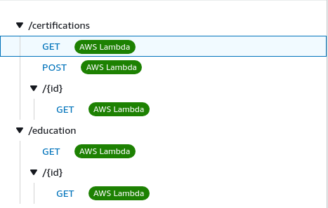

# ApiController

**ApiController** is a small, independent *RESTful API Request Handler*. It handles incoming HTTP requests and returns JSON responses.

The code in this repo is meant to be deployed as an AWS lambda function. The function gets triggered when an HTTP API route is invoked:




The path variable of every route is meant to represent a DynamoDB table:

`https://api.hamzaanas.codes/certifications`

This path is extracted from the URL and is then used to perform DynamoDB actions:

```javascript
const tableName = event.rawPath.split('/')[1];
...
await dynamo.scan({ TableName: tableName, ... });
await dynamo.get({ TableName: tableName, ... });
await dynamo.put({ TableName: tableName, ... });
```

